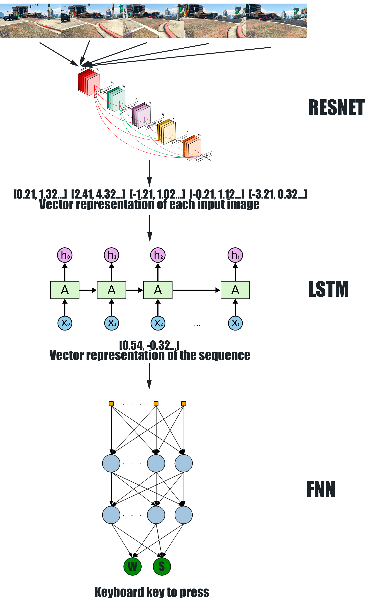
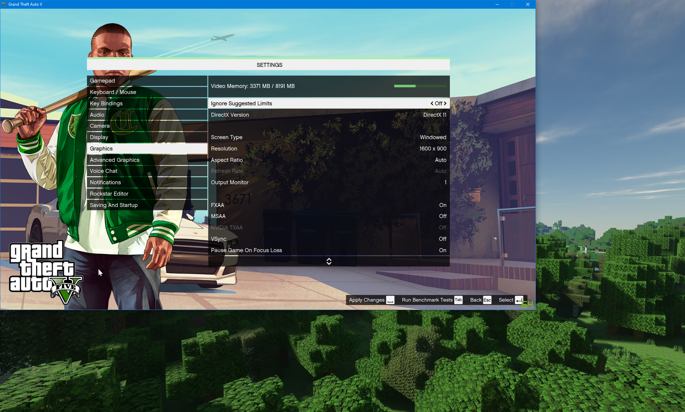
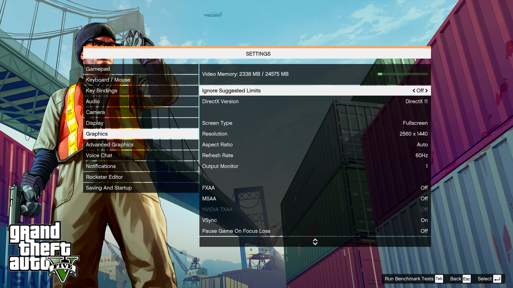

<p align="center">
    <br>
    
    <br>
    <a href="https://twitter.com/intent/tweet?text=Wow:&url=https%3A%2F%2Fgithub.com%2Fikergarcia1996%2FSelf-Driving-Car-in-Video-Games"></a>
    <a href="https://github.com/ikergarcia1996/Self-Driving-Car-in-Video-Games/blob/master/LICENSE"></a>
    <a href="https://github.com/ikergarcia1996/Self-Driving-Car-in-Video-Games/stargazers"></a>
    <a href="https://github.com/ikergarcia1996/Self-Driving-Car-in-Video-Games/network"></a>
    <a href="https://github.com/ikergarcia1996/Self-Driving-Car-in-Video-Games/releases"></a>
    <a href="https://github.com/ikergarcia1996/Self-Driving-Car-in-Video-Games/releases"></a>
    <a href="https://ikergarcia1996.github.io/Iker-Garcia-Ferrero/"></a>
    <br>
    <br>
</p>

A supervised deep neural network that learns how to drive in video games. The main objective of this project is to 
achieve a model that can drive in Grand Theft Auto V. Given a waypoint, the model is expected to reach the destination as
fast as possible avoiding other cars, humans and obstacles. 

The model is trained using human labelled data. We record the game and key inputs of humans while they play the game, this data
is used to train the model. 

While we focus on self-driving cars and the video game Grand Theft Auto V this model can be adapted to play any existing
video game. 

<table>
<tr>
<td>  </td>
<td>  </td>
</tr>
</table>

# Pretrained T.E.D.D. 1104 models
We provide pretrained T.E.D.D. 1104 models that you can use for real-time inference :)  
The models are trained using 130 GB of human labelled data.  
The model has been trained in first-person-view with a route to follow in the minimap.  
The model has learned to drive a large variety of vehicles in different weather conditions (Sun, night, sunny, rain...).  
For each model we provide the best and the last epoch.  
See [Software and HOW-TO Section](https://github.com/ikergarcia1996/Self-Driving-Car-in-Video-Games#software-and-how-to) for instructions on how run the models.

### T.E.D.D. 1104 XXL: 138M Parameters. 
Download link: [See the Releases Tab](https://github.com/ikergarcia1996/Self-Driving-Car-in-Video-Games/releases)  
Accuracy in the test datasets:

|         |              Time              |   Weather  | Micro-Acc K@1 | Micro-Acc k@3 | Macro-Acc K@1 |
|---------|:------------------------------:|:----------:|:-------------:|:-------------:|:-------------:|
| City    |         :sun_with_face:        |   :sunny:  |     53.2      |     84.4      |     46.2      |
| City    |         :sun_with_face:        | :umbrella: |     51.4      |     83.4      |     46.3      |
| City    | :first_quarter_moon_with_face: |   :sunny:  |     54.3      |     85.6      |     46.3      |
| City    | :first_quarter_moon_with_face: | :umbrella: |     47.3      |     82.3      |     49.9      |
| Highway |         :sun_with_face:        |   :sunny:  |     72.7      |     97.7      |     40.6      |
| Highway |         :sun_with_face:        | :umbrella: |     70.6      |     99.3      |     39.6      |
| Highway | :first_quarter_moon_with_face: |   :sunny:  |     77.9      |     99.3      |     45.7      |
| Highway | :first_quarter_moon_with_face: | :umbrella: |     70.9      |     97.6      |     30.8      |

### T.E.D.D. 1104 M: 68M Parameters.
Download link: [See the Releases Tab](https://github.com/ikergarcia1996/Self-Driving-Car-in-Video-Games/releases)  
Accuracy in the test datasets:

|         |              Time              |   Weather  | Micro-Acc K@1 | Micro-Acc k@3 | Macro-Acc K@1 |
|---------|:------------------------------:|:----------:|:-------------:|:-------------:|:-------------:|
| City    |         :sun_with_face:        |   :sunny:  |     52.9      |     84.1      |     43.1      |
| City    |         :sun_with_face:        | :umbrella: |     49.9      |     81.3      |     42.2      |
| City    | :first_quarter_moon_with_face: |   :sunny:  |     54.7      |     85.1      |     48.4      |
| City    | :first_quarter_moon_with_face: | :umbrella: |     49.5      |     81.1      |     41.1      |
| Highway |         :sun_with_face:        |   :sunny:  |     62.5      |     99.2      |     43.1      |
| Highway |         :sun_with_face:        | :umbrella: |     71.9      |     99.3      |     39.2      |
| Highway | :first_quarter_moon_with_face: |   :sunny:  |     79.4      |     99.3      |     45.3      |
| Highway | :first_quarter_moon_with_face: | :umbrella: |     63.0      |     97.2      |     47.2      |
###  T.E.D.D. 1104 S: 26M Parameters.
Download link: [See the Releases Tab](https://github.com/ikergarcia1996/Self-Driving-Car-in-Video-Games/releases)  
Accuracy in the test datasets:

|         |              Time              |   Weather  | Micro-Acc K@1 | Micro-Acc k@3 | Macro-Acc K@1 |
|---------|:------------------------------:|:----------:|:-------------:|:-------------:|:-------------:|
| City    |         :sun_with_face:        |   :sunny:  |     51.0      |     83.0      |     46.3      |
| City    |         :sun_with_face:        | :umbrella: |     49.0      |     82.5      |     45.2      |
| City    | :first_quarter_moon_with_face: |   :sunny:  |     56.3      |     86.6      |     49.0      |
| City    | :first_quarter_moon_with_face: | :umbrella: |     49.4      |     81.4      |     42.5      |
| Highway |         :sun_with_face:        |   :sunny:  |     70.3      |      100      |     68.5      |
| Highway |         :sun_with_face:        | :umbrella: |     71.2      |      100      |     37.6      |
| Highway | :first_quarter_moon_with_face: |   :sunny:  |     80.9      |      100      |     49.1      |
| Highway | :first_quarter_moon_with_face: | :umbrella: |     69.3      |      100      |     61.1      |

# Datasets
We provide train/dev/test datasets for training and evaluating T.E.D.D 1107 models:
- Train Dataset (~130Gb): Coming soon... 
- Dev Dataset (~495Mb): [Download Dev+Test datasets](https://drive.google.com/file/d/1SutVGsQKg0mDUkfGML1nBboLWi5e5_4E/view?usp=sharing).
- Test Dataset (~539Mb): [Download Dev+Test datasets](https://drive.google.com/file/d/1SutVGsQKg0mDUkfGML1nBboLWi5e5_4E/view?usp=sharing).


##  Architecture

T.E.D.D. 1104 is an End-To-End model. We approach the task as a classification task. 
The input of the model is a sequence of 5 images, each image has been recorded with a 0.1s interval. 
The outputs are the correct keys on the keyboard to press. Alternatively T.E.D.D. 1104 can also be trained with a regression objective using Xbox controller inputs. 

<p align="center">
  
</p>

The model consists of three modules:
First, a **Convolutional Neural Network** that encodes each input image in a feature 
vector. We use EfficientNetV2 [arXiv:2104.00298](https://arxiv.org/abs/2104.00298).
We use a **transformer encoder** (https://arxiv.org/abs/1706.03762) to generate bidirectional joint distributions over the feature vector
sequence. Finally, we use the [CLS] token to predict the key combination. 

The model has been implemented using Pytorch: https://pytorch.org/ and PyTorch Lightning: https://www.pytorchlightning.ai/

# Software and HOW-TO
This repository contains all the files need for generating the training data, training the model and using the model to 
drive in the video game (Real-Time Inference). The software has been written in Python 3. You can train a model in any OS. 
Data generation and inference only work in Windows 10/11 which are the only OS supported by most video games. 

## Requirements
You can train and evaluate models on any Operating System (We use Linux for training).  
Running real time inference (Let TEDD1104 drive in GTAV) requires Windows 10/11.
```
Python 3.7 or newer (3.9.7 tested)
Pytorch (1.12.0 or newer)
Torchvision (>=0.13.0 and < 0.15.0. Compatibility with torchvision >=0.15.0 will be added in a future release)
PyTorch Lightning (1.6.0 or newer)
torchmetrics
scikit-image
numpy
PIL/Pillow
cv2 (opencv-python)
tkinter
tabulate
fairseq (If you want to train a model using AdaFactor)
wandb or tensorboard for training (Set "--report_to" accordingly)
win32api (PythonWin) - Only required for running real time inference (Let TEDD play the game)
                       Should be installed by default in newest Python versions for Windows. 


pygame - Only required if you wish to generate data using a Xbox Controller
PYXInput - Only required if you wish to use a Vitual Xbox Controller as game controller instead of the keyboard. 
           See controller\README.md for installation instructions. 
```

## Run Inference 
How to use a pretrained T.E.E.D. 1104 model to drive in GTAV

### Configure the game
You can run the game in "windowed mode" or "full screen" mode. 
If you want to run the game in "windowed mode":
- Run GTAV and set your game to windowed mode.
- Set the desired game resolution (i.e 1600x900 resolution).
- Move the game window to the top left corner.
- Run the script with the "--width 1600" and "--height 900" parameters.

<p align="center">
  
</p>
  

If you want to run the game in "full screen" mode:
- Run GTAV **in your main screen** (The one labelled as screen nº1) and set your game to full-screen mode.
- Configure the game resolution with the resolution of your screen (i.e 2560x1440 resolution).
- Run the script with the "--width 2560", "--height 1440" and "--full_screen" parameters.

<p align="center">
  
</p>

In addition, if you want to run the pretrained models that we provide you must:
- Set the Settings>Camera>First person Vehicle Hood to "On"
- Change the camera to first-person-view (Push "V")
- Set a waypoint in the minimap

<p align="center">
  
</p>


### Run a Model

Use the *run_TEDD1104.py* script to run a model for real-time inference. See "run_TEDD1104.py -h" to get a description of all the available parameters. 

```
python run_TEDD1104.py \
--checkpoint_path "models\TEDD1107_model.ckpt" \
--width 1920 \
--height 1080 \
--num_parallel_sequences 5 \
--control_mode keyboard
```
num_parallel_sequences: number of parallel sequences to record, if the number is higher the model will do more 
iterations per second (will push keys more often) provided your GPU is fast enough. This improves the performance of the 
model but increases the CPU and RAM usage. 

control_mode: Choose between keyboard and controller (Xbox Controller). It doesn't matter how the model has been trained, 
the output of the model will be converted to the desired control_mode. 

If the model does not perform as expected (It doesn't seem to do anything or always chooses the same action) you can 
push "L" while the script is running to verify the input images. 

## Train your own model
### Self Driving Model

Use the *train.py* script to train a new model from scratch or continue training a model. 
See "train.py -h" to get a description of all the available parameters. 
See the [training_scripts](/training_scripts) folder to see the training commands that we used
to train the released models. 


Example command:
```sh
python3 train.py --train_new \
  --train_dir dataset/train \
  --val_dir  dataset/dev \
  --output_dir runs/TEDD1104-base \
  --encoder_type transformer \
  --batch_size 16 \
  --accumulation_steps 4 \
  --max_epochs 12 \
  --cnn_model_name efficientnet_b4 \
  --num_layers_encoder 4 \
  --mask_prob 0.2 \
  --dropout_cnn_out 0.3 \
  --dropout_encoder 0.1 \
  --dropout_encoder_features 0.3 \
  --control_mode keyboard \
  --dataloader_num_workers 32 \
  --val_check_interval 0.5 
```

You can continue training a model using the "--continue_training" flag 
```sh
python3 train.py --continue_training \
  --checkpoint_path runs/TEDD1104-base/model.ckpt \
  --train_dir dataset/train \
  --val_dir  dataset/dev \
  --output_dir runs/TEDD1104-base \
  --batch_size 16 \
  --accumulation_steps 4 \
  --max_epochs 24 \
  --cnn_model_name efficientnet_b4 \
  --dataloader_num_workers 32 \
  --val_check_interval 0.5 
```

#### Evaluate model:
Use the eval.py script to evaluate a model in the test dataset.
```sh
python3 eval.py \
  --checkpoint_path models/tedd_1104_S/epoch=4-step=198544.ckpt \
  --batch_size 32 \
  --test_dirs \
   /data/gtaai_datasets/dev \
   /data/gtaai_datasets/test/car_city_day_clear \
   /data/gtaai_datasets/test/car_city_day_rain \
   /data/gtaai_datasets/test/car_city_night_clear \
   /data/gtaai_datasets/test/car_city_night_rain \
   /data/gtaai_datasets/test/car_highway_day_clear \
   /data/gtaai_datasets/test/car_highway_day_rain \
   /data/gtaai_datasets/test/car_highway_night_clear \
   /data/gtaai_datasets/test/car_highway_night_rain \
  --output_path results/tedd_1104_S.tsv
```

### Image Reordering Model
An experimental unsupervised pretraining objective. We shuffle the order of the input sequence and the model must 
predict the correct order of the input images. See "train_reorder.py -h" to get a description of all the available parameters.
This script is almost identical to the self-driving script, except it only supports transformer encoder models and doesn't
have a 'control_mode' parameter. Refer to the [previous section](#self-driving-model) for training/eval details. 
After training with the image reordering objective you can finetune the model in the Self-Driving objective. 

```sh
python3 train.py \
--new_model \
--checkpoint_path models/image_reordering.ckpt \
...
```

Use the eval_reorder.py script to evaluate an image reordering model in the test dataset.


## Generate Data

Use the *generate_data.py* script to generate new data for training or evaluation. See Use "run_TEDD1104.py -h" to get a description of all the available parameters.
Configure the game following [The Configure the game section](#configure-the-game). 
```
python generate_data.py \
--save_dir "dataset/train" \
--width 1920 \
--height 1080 \
--control_mode keyboard
```

If control_mode is set to "keyboard" we will record the state of the "WASD" keys. If control_mode is set to "controller"
we will record the state of the first Xbox Controller that Pygame can detect. 
To avoid generating a huge unbalanced dataset the script will try to balance the data while recording. The more examples
of a given class recorded the lower the probability of recording a new example of that class. If you want 
to disable this behaviour use the "--save_everything" flag. 


## Citation:
```
@misc{TEDD1104,
  author = {"Garc{\'\i}a-Ferrero, Iker},
  title = {TEDD1104: Self Driving Car in Video Games},
  year = {2022},
  publisher = {GitHub},
  journal = {GitHub repository},
  howpublished = {\url{https://github.com/ikergarcia1996/Self-Driving-Car-in-Video-Games}},
}
```

Author: **Iker García-Ferrero**:  
- [My Webpage](https://ikergarcia1996.github.io/Iker-Garcia-Ferrero/)  
- [Twitter](https://twitter.com/iker_garciaf)

