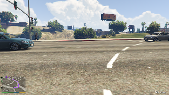
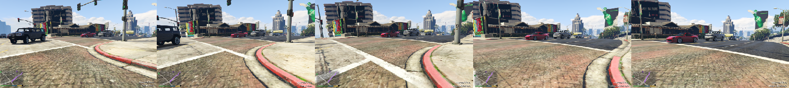

# T.E.D.D. 1104
A supervised deep neural network that learns to drive in video games. The main objective of this project is to 
achieve a model that can drive in Grand Theft Auto V. The model is not expected to drive following traffic 
regulations, but imitate how humans drive in this game: Drive at full speed through the city avoiding other 
cars and occasionally humans and lampposts.
A marker will be set in the game map, the model should be able to arrive to the marker driving trough the city. 

The model is trained using human labeled data. We record the game and key inputs of humans while the play the game, this data
is used to train the model. 

While we focus on self-driving cars and the video game Grand Theft Auto V this model can be adapted to play any existing
video game. 

<p align="center">
  
</p>

## Architecture
Most previous models that attempt to achieve self-driving in video games consists of a deep convolutional neural network 
(usually Inception or Resnet). The models take as input a single image.
 Would you be able to know what to do if I give you this image?
 
<p align="center">
  
</p>

You may think that the best choice is to brake to avoid the blue/gray car, but, 
what if both cars are stopped waiting for you to cross the street? What if your car is 
currently driving in reverse? Does your current speed and the speed of the other cars allow you to 
cross the road without hitting them? A single image does not provide enough information to successfully 
achieve a self-driving car. More information is needed, that is why our approach uses sequences of images. 
5 images are captured with an interval of 1/10 seconds between them, this approach gives the model information 
about the motion of other cars, environment and himself. 


<p align="center">
  
</p>

T.E.D.D. 1104 consists of a Deep Convolutional Neural Network (Resnet: K He et al. 2016) followed by 
a Recurrent Neural Network (LSTM). The CNN receives as input a sequence of 5 images and generates for each one a 
vector representation. These representations are fed into the RNN that generates a unique vector representation 
for the entire sequence. Finally, a Feed-Forward Neural Network outputs the key to press in the keyboard based 
on the vector representation for the sequence.

<p align="center">
  
</p>

The model has been implemented using Pytorch: https://pytorch.org/

## Software and HOW-TO
This repository contains all the files need for generating the training data, training the model and use the model to 
drive in the video game. The software has been written in Python 3. This model has only been tested in Windows 10 because
is the only supported SO by most video games.  

### Requirements
```
Pytorch
Torchvision
Nvidia Apex (only for FP16 training)
numpy
cupy (optional but highly recommended especially for training the model, 10x speed up in data preprocessing comparated with numpy)
cv2 (opencv-python)
glob
h5py
json 
win32api (PythonWin) - Should be installed by default in newest Python versions (Python 3.7 reccomended)
```

### Generate dataset
* File: generate_data.py
* Usage example: 
```
python generate_data.py --save_dir tedd1007\training_data
```
* How-to:
  * Set your game in windowed mode
  * Set your game to 1600x900 resolution
  * Move the game window to the top left corner, there should be a blue line of 1 pixel in the left bezel of your
         screen and the window top bar should start in the top bezel of your screen.
  * Play the game! The program will capture your screen and generate the training examples. There will be saved
         as files named "training_dataX.npz" (numpy compressed array). Don't worry if you re-launch this script,
          the program will search for already existing dataset files in the directory and it won't overwrite them.
  * At any moment push Q + E to stop the program.
  
<p align="center">
  
</p>
  


### Train the model
* File: train.py
* Usage example: 
```
python train.py --train_new 
--train_dir tedd1007\training_data\train 
--dev_dir tedd1007\training_data\dev 
--test_dir tedd1007\training_data\test 
--output_dir tedd1007\models 
--batch_size 10 
--num_epochs 5 
--fp16
```
* How-to:
  Train a model using the default hyper parameters, to see a description of the network hyper parameters use 
  "python train.py -h" or check the "train.py" and "model.py" files. train, dev and test directories should contain
   as many files named "training_dataX.npz" as you want. The FP16 flag allows you to use Mixed Precision Training if
   you have a modern Nvidia GPU  with Tensor cores, it uses the Nvidia Apex library: https://github.com/NVIDIA/apex 
   (Note: model trained using FP16 cannot be run using FP32 and vice versa). The model is VERY memory demanding, as a
   reference I use a batch size of 10 for a RTX 2080 (8GB VRAM) for FP16 training. 
   
 * If you want to continue training from a checkpoint use:
   
 ```
python train.py --continue_training
--train_dir tedd1007\training_data\train 
--dev_dir tedd1007\training_data\dev 
--test_dir tedd1007\training_data\test 
--output_dir tedd1007\models 
--batch_size 10 
--num_epochs 5 
--checkpoint_path tedd1007\checkpoint\epoch1checkpoint.pt
--fp16
```
   
### Run the model
* File: run_TEDD1104.py
* Pretrained-Models: Coming soon!!!
* Usage example: 
```
python run_TEDD1104.py --model_dir D:\GTAV-AI\models --show_current_control
```
* How-to:
  * Set your game in windowed mode
  * Set your game to 1600x900 resolution
  * Move the game window to the top left corner, there should be a blue line of 1 pixel in the left bezel of your
         screen and the window top bar should start in the top bezel of your screen.
  * Let the AI play the game!
  * Push Q + E to exit
  * Push L to see the input images
  * Push and hold J to use to use manual control
          
<p align="center">
  
</p>
  
  

# Authors:
```
- Iker García
  Personal Webpage: https://ikergarcia1996.github.io/Iker-Garcia-Ferrero/
```

This repository is a greatly improved version of the model we published 2 years ago: https://github.com/ikergarcia1996/GTAV-Self-driving-car (by Eritz Yerga and Iker García)
  
